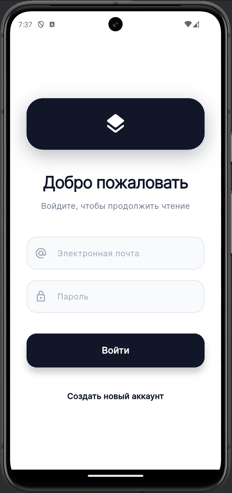
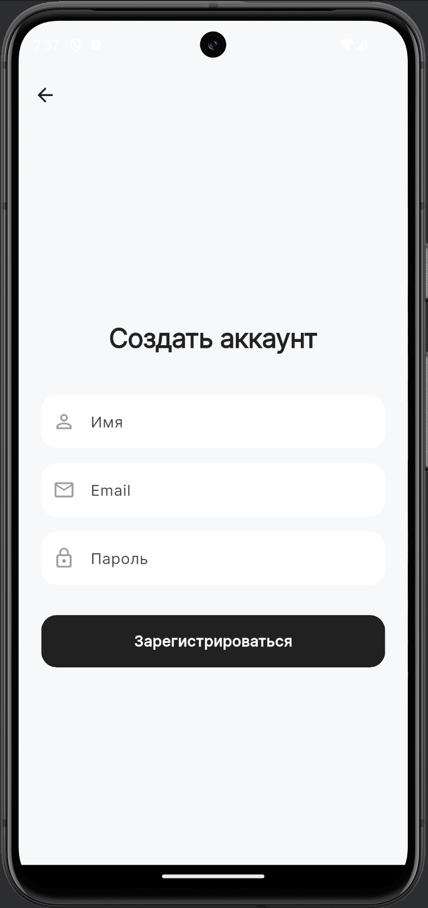
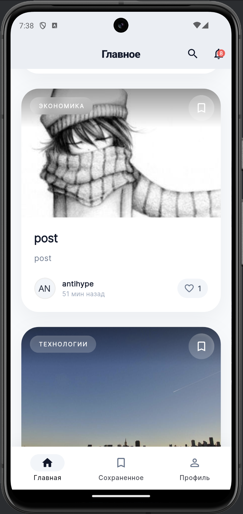
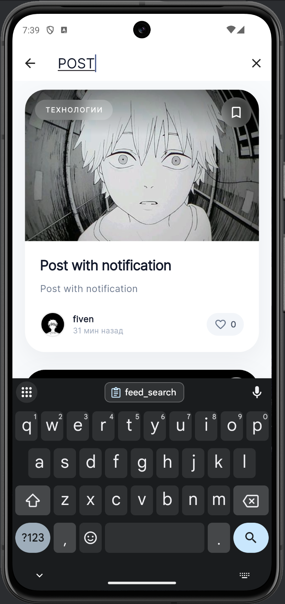
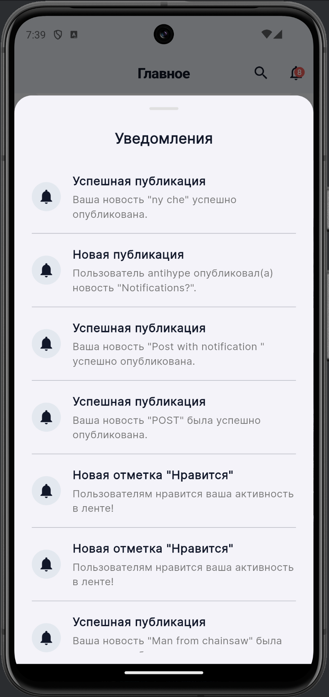
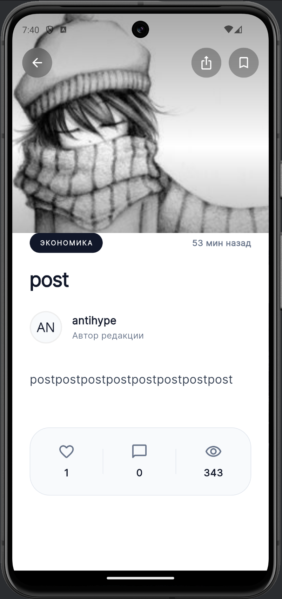
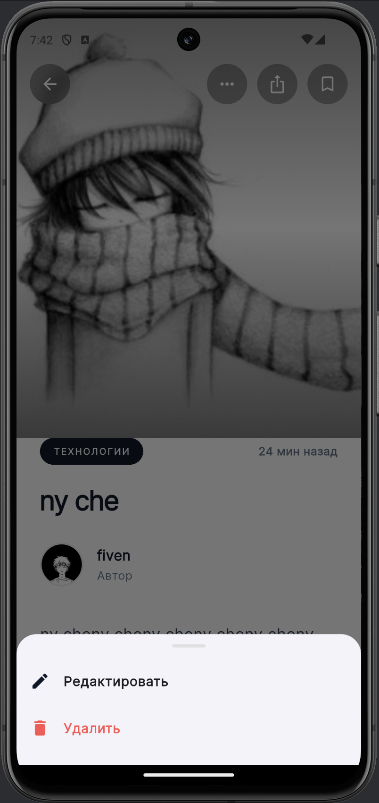
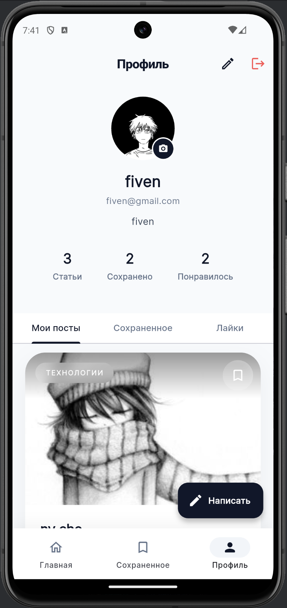
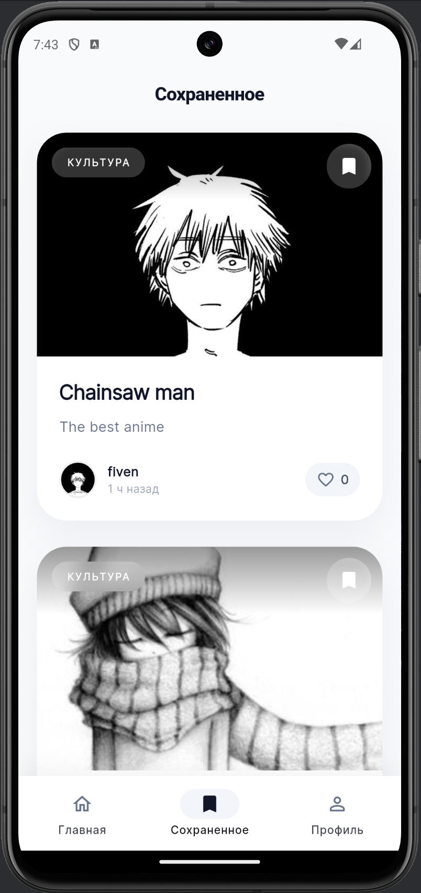
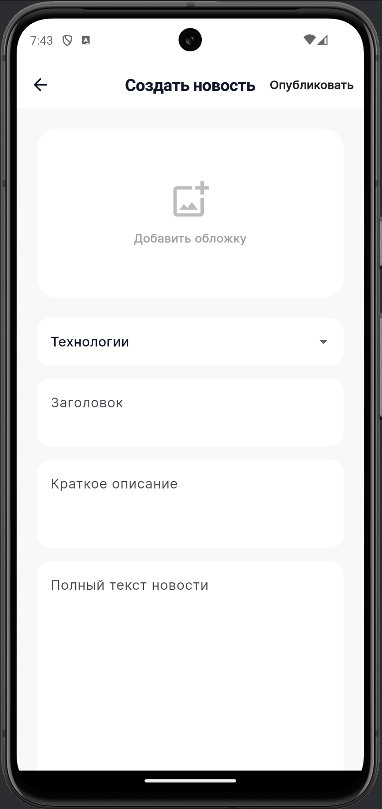

# 📰 FlutterNewsPro

[](https://flutter.dev/)
[](https://dart.dev/)
[](https://dart.dev/guides/language/effective-dart)
[](LICENSE)

Современное мобильное приложение для чтения и публикации новостей, разработанное на Flutter. Проект демонстрирует применение лучших практик разработки, чистой архитектуры и продуманного UI/UX.

---

## 📑 Оглавление

- [Ключевые возможности](#-ключевые-возможности)
- [Визуализация интерфейса (Скриншоты)](#-визуализация-интерфейса-скриншоты)
- [Технологический стек](#-технологический-стек)
- [Архитектурные решения](#-архитектурные-решения)
- [Установка и запуск](#-установка-и-запуск)
- [Вклад в развитие](#-вклад-в-развитие)

---

## ✨ Ключевые возможности

### 🔐 Auth & Profile
* Полноценная система авторизации (Login/Register).
* Управление профилем: редактирование имени, био и смена аватара (локальное хранение).
* Просмотр статистики пользователя (количество постов, лайков, сохраненного).

### 📰 Content & Feed
* Динамическая лента новостей с пагинацией (бесконечный скролл) и кастомным Pull-to-Refresh.
* Детальный просмотр статьи с Hero-анимацией изображений и стеклянным (Glassmorphism) UI элементов управления.
* Категоризация постов.

### 🛠 CRUD & Interactions
* Полный цикл управления собственными новостями: создание (с выбором обложки), редактирование, удаление.
* Система лайков и добавления в закладки (Bookmark) с мгновенным UI-откликом.
* Локальный поиск по всей базе новостей.

### 🔔 Notifications
* In-app система уведомлений о событиях (публикация, лайки, добавление в закладки).
* Индикатор непрочитанных уведомлений в AppBar.

---

## 📱 Визуализация интерфейса (Скриншоты)

Для корректного отображения скриншотов в репозитории, убедитесь, что соответствующие файлы добавлены в папку `screenshots/` в корне проекта.

### 1. Онбординг и Авторизация

| Экран входа | Экран регистрации |
|:---:|:---:|
|  |  |

### 2. Основной пользовательский путь (Browsing)

| Главная лента | Поиск новостей | Панель уведомлений |
|:---:|:---:|:---:|
|  |  |  |

### 3. Детализация и Взаимодействие

| Просмотр статьи | Действия (Автор) |
|:---:|:---:|
|  |  |

### 4. Профиль и Управление контентом

| Профиль пользователя | Сохраненное | Создание новости |
|:---:|:---:|:---:|
|  |  |  |

---

## 🛠 Технологический стек

Проект минимизирует количество внешних зависимостей, отдавая предпочтение нативным решениям и легким пакетам.

* **Core:** Flutter SDK (Channel stable), Dart.
* **State Management:** Нативное решение на базе `ChangeNotifier` и `AnimatedBuilder` для обеспечения максимальной производительности и контроля над перерисовкой UI.
* **Persistence (Local Storage):** `shared_preferences` (для пользовательских данных и JSON-кеша новостей), нативная файловая система (через `path_provider` для аватаров и обложек).
* **Media Processing:** `image_picker` (выбор изображений), `cached_network_image` (эффективное кеширование сетевых изображений).
* **UI/UX UX UX UX UX:** `pull_to_refresh` (кастомные контроллеры ленты), `shimmer` (эффекты загрузки), `share_plus` (системный шеринг).

---

## 📁 Архитектурные решения

Приложение следует принципам **Layered Architecture** (Слоистая архитектура), что обеспечивает слабую связанность компонентов и высокую тестируемость.

```text
lib/
├── controllers/ # Бизнес-логика и управление состоянием (ViewModel layer)
├── models/      # Data transfer objects (DTO) и сущности
├── screens/     # Представления (UI layer), сгруппированные по фичам
├── services/    # Работа с внешними данными (API mock, Local storage)
├── widgets/     # Переиспользуемые UI-компоненты
└── main.dart    # Точка входа и конфигурация приложения
## 🚀 Установка и запуск
Для запуска проекта вам потребуется установленный Flutter SDK и настроенный эмулятор (Android/iOS) или подключенное физическое устройство.

```text

# 1. Клонирование репозитория
git clone [https://github.com/your-username/news-app-flutter.git](https://github.com/your-username/news-app-flutter.git)

# 2. Переход в директорию проекта
cd news-app-flutter

# 3. Очистка кеша и получение зависимостей
flutter clean
flutter pub get

# 4. Запуск приложения в debug-режиме
flutter run
```


